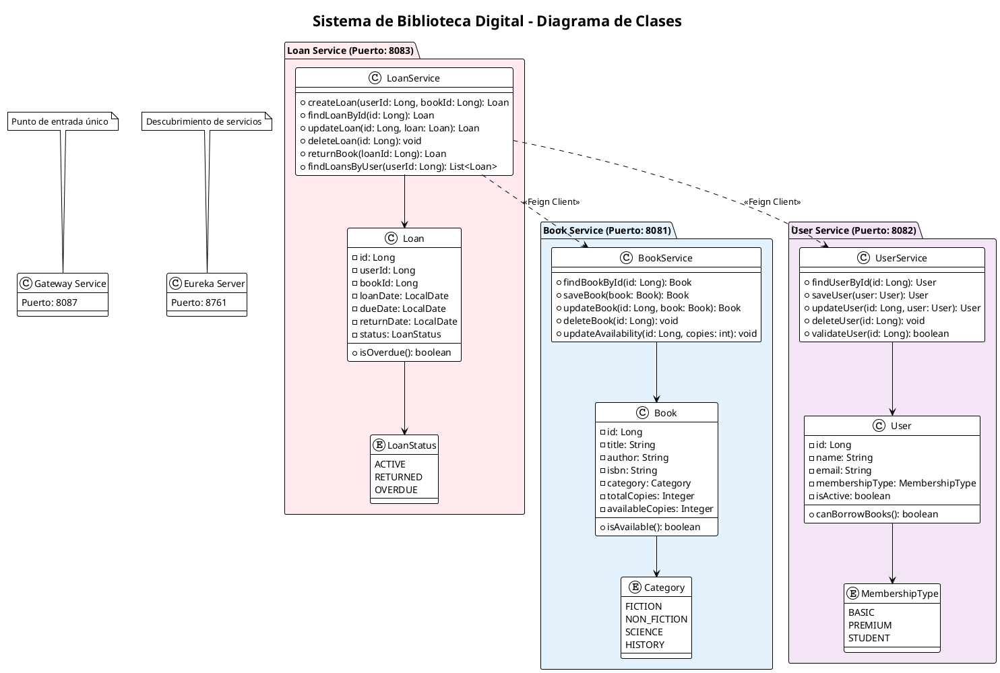
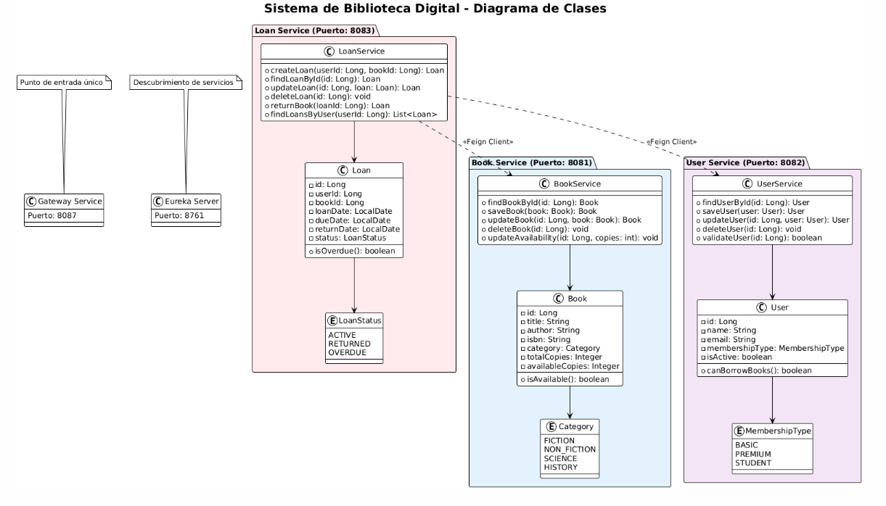

# 📚 Iron Library - Arquitectura de Microservicios

> Sistema integral de gestión bibliotecaria construido con arquitectura de microservicios Spring Boot

## 🏗️ Descripción de la Arquitectura

Iron Library es un sistema distribuido compuesto por 5 microservicios que trabajan en conjunto para proporcionar una solución completa de gestión bibliotecaria.

### 🎯 Microservicios

| Servicio | Puerto | Repositorio | Descripción |
|----------|--------|-------------|-------------|
| **Discovery Server** | 8761 | [discovery-server](https://github.com/IronLibray/discovery-server) | Registro de servicios Eureka |
| **Gateway Service** | 8087 | [gateway-service](https://github.com/IronLibray/gateway-service) | Gateway API y enrutamiento |
| **User Service** | 8082 | [user-service](https://github.com/IronLibray/user-service) | Gestión de usuarios y membresías |
| **Book Service** | 8081 | [book-service](https://github.com/IronLibray/book-service) | Catálogo de libros e inventario |
| **Loan Service** | 8083 | [loan-service](https://github.com/IronLibray/loan-service) | Operaciones y seguimiento de préstamos |

## 🚀 Inicio Rápido

### Prerrequisitos
- Java 21
- Maven 3.6+
- MySQL 8.0+

### Configuración de Bases de Datos
```sql
CREATE DATABASE user_service;
CREATE DATABASE book_service;
CREATE DATABASE loan_service;
```

### Iniciar Servicios (en orden)
```bash
# 1. Clonar todos los repositorios
git clone https://github.com/IronLibray/discovery-server.git
git clone https://github.com/IronLibray/gateway-service.git
git clone https://github.com/IronLibray/user-service.git
git clone https://github.com/IronLibray/book-service.git
git clone https://github.com/IronLibray/loan-service.git

# 2. Iniciar Discovery Server primero
cd discovery-server && ./mvnw spring-boot:run

# 3. Iniciar Gateway Service
cd ../gateway-service && ./mvnw spring-boot:run

# 4. Iniciar servicios de negocio (pueden ejecutarse en paralelo)
cd ../user-service && ./mvnw spring-boot:run &
cd ../book-service && ./mvnw spring-boot:run &
cd ../loan-service && ./mvnw spring-boot:run &
```

### Verificar Instalación
- 🎛️ **Panel de Eureka**: http://localhost:8761
- 🌐 **Gateway API**: http://localhost:8087
- 🏥 **Verificaciones de Salud**: 
  - http://localhost:8087/api/users/health
  - http://localhost:8087/api/books/health
  - http://localhost:8087/api/loans/health

## 🎯 Arquitectura del Sistema

```
Aplicaciones Cliente
        ↓
   Gateway Service (8087)
        ↓
┌─────────────────────────────┐
│     Eureka Server (8761)    │
└─────────────────────────────┘
        ↓
┌─────────────────────────────┐
│  User Service    Book Service   │
│     (8082)        (8081)     │
│         ↘        ↙          │
│       Loan Service (8083)    │
└─────────────────────────────┘
        ↓
   Bases de Datos MySQL
```

## 🛠️ Stack Tecnológico

- **Framework**: Spring Boot 3.4.6
- **Descubrimiento de Servicios**: Netflix Eureka
- **Gateway API**: Spring Cloud Gateway
- **Comunicación**: OpenFeign
- **Base de Datos**: MySQL + Spring Data JPA
- **Testing**: JUnit 5, Mockito, Postman
- **Build**: Maven

## 📡 Endpoints de la API

Todos los endpoints son accesibles a través del Gateway en `http://localhost:8087`

### Usuarios
- `GET /api/users` - Obtener todos los usuarios
- `POST /api/users` - Crear usuario
- `PUT /api/users/{id}` - Actualizar usuario
- `DELETE /api/users/{id}` - Eliminar usuario
- `GET /api/users/stats` - Estadísticas de usuarios

### Libros
- `GET /api/books` - Obtener todos los libros
- `POST /api/books` - Crear libro
- `PUT /api/books/{id}` - Actualizar libro
- `DELETE /api/books/{id}` - Eliminar libro
- `GET /api/books/available` - Libros disponibles

### Préstamos
- `GET /api/loans` - Obtener todos los préstamos
- `POST /api/loans` - Crear préstamo
- `PATCH /api/loans/{id}/return` - Devolver libro
- `DELETE /api/loans/{id}` - Eliminar préstamo
- `GET /api/loans/stats` - Estadísticas de préstamos

## 🧪 Testing

Cada servicio incluye testing integral:
- **Tests Unitarios**: Lógica de la capa de servicio
- **Tests de Integración**: Capas de controlador y repositorio
- **Tests End-to-End**: Flujos completos de microservicios

### Colección de Postman
Importa nuestra suite completa de tests: [Iron Library Test Suite](https://github.com/IronLibray/postman-collection)

## 🎯 Características Principales

### Lógica de Negocio
- **Membresías Multinivel**: Básica, Premium, Estudiante con diferentes límites de préstamo
- **Gestión de Inventario**: Seguimiento en tiempo real de disponibilidad de libros
- **Gestión de Préstamos**: Fechas de vencimiento, extensiones, seguimiento de retrasos
- **Estadísticas**: Reportes integrales en todos los servicios

### Características Técnicas
- **Descubrimiento de Servicios**: Registro y descubrimiento automático
- **Balanceador de Carga**: Distribución automática vía Eureka
- **Circuit Breakers**: Tolerancia a fallos (mejora futura)
- **Enrutamiento Centralizado**: Punto de entrada único vía Gateway
- **Soporte CORS**: Peticiones cross-origin habilitadas

## 🎨 Diagrama UML

### Estructura de Clases del Sistema



## 📊 Estado del Proyecto

✅ **Características Completadas**
- Todos los microservicios funcionando y comunicándose
- Operaciones CRUD completas
- Cobertura integral de tests
- Manejo de errores y validación
- Documentación y diagramas UML

🚀 **Mejoras Futuras**
- Autenticación y Autorización (JWT)
- Trazabilidad Distribuida (Sleuth + Zipkin)
- Circuit Breakers (Resilience4j)
- Containerización (Docker + Kubernetes)

## 🔧 Configuración de Desarrollo

### Variables de Entorno
```properties
# User Service
MYSQL_URL=jdbc:mysql://localhost:3306/user_service
MYSQL_USER=root
MYSQL_PASSWORD=root

# Book Service  
MYSQL_URL=jdbc:mysql://localhost:3306/book_service
MYSQL_USER=root
MYSQL_PASSWORD=root

# Loan Service
MYSQL_URL=jdbc:mysql://localhost:3306/loan_service
MYSQL_USER=root
MYSQL_PASSWORD=root
```

### Puertos por Defecto
- Discovery Server: 8761
- Gateway Service: 8087
- User Service: 8082
- Book Service: 8081
- Loan Service: 8083

## Enlaces adicionales
- [Trello](https://trello.com/b/mRM2nCLx/ironlibrary)
- [Presentación](https://www.canva.com/design/DAGo1uvvZo8/BrLWajSdvTJ9ziYHY5lbTg/view?utm_content=DAGo1uvvZo8&utm_campaign=designshare&utm_medium=link2&utm_source=uniquelinks&utlId=h24b2f4b309)

## 🤝 Contribución

Este proyecto es parte de una iniciativa de aprendizaje de arquitectura de microservicios. Cada servicio se desarrolla y mantiene de forma independiente.

## 📄 Licencia

Este proyecto está licenciado bajo la Licencia MIT - consulta los archivos LICENSE de cada repositorio individual para más detalles.

---

**🏗️ Construido con Arquitectura de Microservicios Spring Cloud**  
**📚 Organización Iron Library - 2025**
